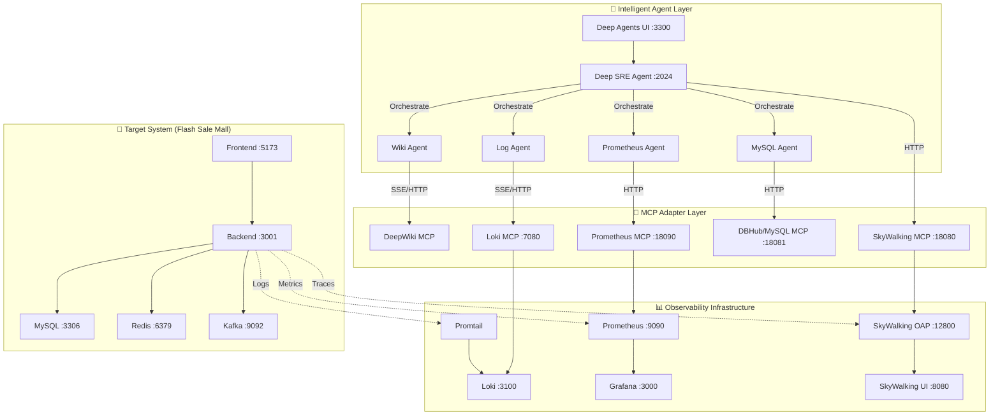

# 🤖 Deep SRE Agent & Flash Sale Mall

[中文文档](README_CN.md)

**Deep SRE Agent** is a cutting-edge intelligent SRE (Site Reliability Engineering) experimental platform designed to explore the application of LLMs (Large Language Models) in the field of SRE.

This project builds a complete microservices-based e-commerce system (**Flash Sale Mall**) and equips it with an intelligent operations agent (**Deep SRE Agent**) based on the [deepagents](https://github.com/langchain-ai/deepagents) framework.

The Agent can act like a human SRE engineer, proactively inspecting the system, analyzing logs, querying metrics, diagnosing databases, and even performing root cause analysis through natural language.

---

## 🎥 Demo

<video src="packages/demo.mp4" controls="controls" style="max-width: 100%;">
  Your browser does not support the video tag.
</video>

> If the video does not play, please check [packages/demo.mp4](packages/demo.mp4) directly.

---

## 🏗️ Overall Architecture

The project adopts a layered architecture design, from bottom to top: Target Business System, Observability Infrastructure, MCP Adapter Layer, and Intelligent Agent Layer.



### Core Components

1.  **Flash Sale Mall (Target System)**
    *   A high-concurrency flash sale mall based on Spring Boot 3 + React 18.
    *   Integrated full-link monitoring: Micrometer (Metrics), Logback (Logs), SkyWalking (Traces).
    *   See: [README_flashMall.md](README_flashMall.md)

2.  **Observability Stack**
    *   **Prometheus**: Metric storage and querying.
    *   **Loki**: Log aggregation and retrieval.
    *   **SkyWalking**: Distributed tracing.
    *   **Grafana**: Unified monitoring dashboard.

3.  **MCP Layer (Model Context Protocol Layer)**
    *   Acts as a standard bridge between LLM and infrastructure.
    *   **Prometheus MCP**: Allows Agent to execute PromQL.
    *   **Loki MCP**: Allows Agent to use LogQL to query logs.
    *   **DBHub**: Allows Agent to execute SQL to query data.
    *   **SkyWalking MCP**: Allows Agent to query topology and traces.

4.  **Sub-Agent Layer**
    *   **Prometheus Agent**: Focuses on metric query and analysis, generating PromQL and interpreting monitoring data.
    *   **Log Agent**: Focuses on log retrieval, using LogQL to filter error stacks and exceptions.
    *   **MySQL Agent**: Focuses on database diagnosis, executing SQL to query business data or slow queries.
    *   **Wiki Agent**: Focuses on knowledge base retrieval, providing system architecture documents and SRE runbook support.

5.  **Deep SRE Agent (Main Intelligent Agent)**
    *   A Multi-Agent system orchestrator based on LangGraph.
    *   Responsible for receiving user instructions, decomposing tasks, scheduling sub-agents, and summarizing reasoning results.

---

## 🚀 Quick Start

### 1. Prerequisites
*   **Docker & Docker Compose**: Core dependency, used to start all services.
*   **API Key**: Requires OPENAI or other compatible LLM API Key.

### 2. Configure Agent
Copy the environment variable template and fill in your API Key:
```bash
cp deep_sre_agent/.env.example deep_sre_agent/.env.dev
# Edit .env.dev and fill in keys, etc.
```

### 3. One-Click Start
Use Docker Compose to bring up the entire environment (including Mall, Monitoring, MCP Services, Agent, and UI):

```bash
docker compose up -d --build
```

> **Note**: The first startup requires downloading multiple images and building the Agent environment, which may take tens of minutes.

### 4. Access the System

| Service Name | URL / Port | Description |
| :--- | :--- | :--- |
| **Deep Agents UI** | http://localhost:3300 | **Agent Entry**, chat with SRE Agent here |
| **Flash Sale Mall** | http://localhost:5173 | Mall Frontend, test flash sales here |
| **LangGraph API** | http://localhost:2024 | Agent Backend API (for UI) |
| **Backend API** | http://localhost:3001 | Mall Backend API |
| **Grafana** | http://localhost:3000 | Monitoring Dashboard (Account: admin / admin123) |
| **Prometheus** | http://localhost:9090 | Native Metric Query Interface |

---

## 💻 Development Guide

### SRE Agent Development
Agent code is located in the `deep_sre_agent/` directory.
*   **Architecture**: Uses LangGraph to orchestrate multi-agent collaboration.
*   **Debugging**:
    *   Recommended to use Jupyter Notebook (`research_agent.ipynb`) for interactive debugging.
    *   Or run `langgraph dev` locally to start the API server.
*   **Extension**: Create a new Agent directory under `deep_sre_agent/` and write `mcp_client.py` to connect to new MCP services.

### Mall Business Development
Business code is located in `backend-spring/` (Backend) and `src/` (Frontend).
*   **Backend**: Spring Boot 3.3, Java 21.
*   **Frontend**: React 18, Vite, TailwindCSS.
*   **Local Run**: Refer to the development guide in [README_flashMall.md](README_flashMall.md).

---

## 🔌 Service Port Mapping

| Container Service | Port | Usage |
| :--- | :--- | :--- |
| `deep-agents-ui` | **3300** | Agent Chat Interface (Next.js) |
| `deep-sre-agent` | **2024** | Agent Core Logic (LangGraph API) |
| `flashsale-frontend` | **5173** | Mall Frontend (Nginx/Vite) |
| `flashsale-backend` | **3001** | Mall Backend (Spring Boot) |
| `flashsale-grafana` | **3000** | Monitoring Visualization |
| `flashsale-prometheus`| **9090** | Metric Storage |
| `flashsale-loki` | **3100** | Log Storage |
| `flashsale-mysql` | **3306** | Business Database |
| `flashsale-redis` | **6379** | Cache & Rate Limiting |
| `flashsale-kafka` | **9092** | Message Queue |
| `prometheus-mcp` | **18090** | Prometheus MCP Adapter |
| `dbhub` (MySQL MCP) | **18081** | SQL Execution Adapter |
| `loki-mcp` | **7080** | Loki MCP Adapter |

---

## 🤝 Contribution & License

Issues and PRs are welcome!

*   **Contribution Guide**: See [CONTRIBUTING.md](CONTRIBUTING.md) (if available)
*   **License**: [MIT License](LICENSE)

---
**Deep SRE Agent** - Make operations smarter, make systems more reliable.
