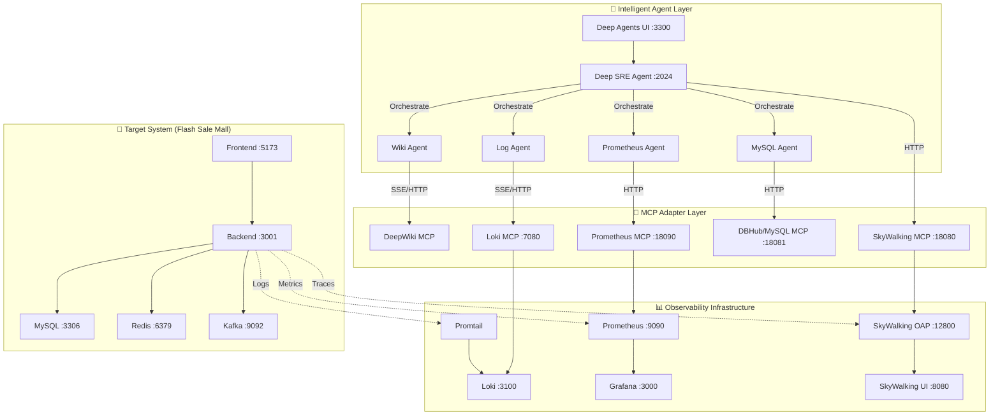

# 🤖 Deep SRE Agent & Flash Sale Mall

[English](README.md)

**Deep SRE Agent** 是一个前沿的智能运维实验平台，旨在探索 LLM (Large Language Model) 在 SRE (Site Reliability Engineering) 领域的应用。

本项目构建了一个完整的微服务架构电商系统 (**Flash Sale Mall**)，并为其配备了一套基于[deepagents](https://github.com/langchain-ai/deepagents) 开发框架开发 的智能运维代理 (**Deep SRE Agent**)。
Agent 能够像人类 SRE 工程师一样，通过自然语言主动巡检系统、分析日志、查询指标、诊断数据库，甚至进行故障根因分析。

---

## 演示

<video src="packages/demo01.mp4" controls="controls" style="max-width: 100%;">
  您的浏览器不支持 video 标签。
</video>
<video src="packages/demo02.mp4" controls="controls" style="max-width: 100%;">
  您的浏览器不支持 video 标签。
</video>

> 如果无法播放，请直接查看 [packages/demo.mp4](packages/demo.mp4)。

---

## �🏗️ 总体架构

项目采用分层架构设计，从下至上依次为：被测业务系统、可观测性基础设施、MCP 适配层、智能 Agent 层。



### 核心组件

1.  **Flash Sale Mall (被测系统)**
    *   基于 Spring Boot 3 + React 18 的高并发秒杀商城。
    *   集成全链路监控：Micrometer (Metrics), Logback (Logs), SkyWalking (Traces)。
    *   详见：[README_flashMall.md](README_flashMall.md)

2.  **Observability Stack (可观测性栈)**
    *   **Prometheus**: 指标存储与查询。
    *   **Loki**: 日志聚合与检索。
    *   **SkyWalking**: 分布式链路追踪。
    *   **Grafana**: 统一监控大屏。

3.  **MCP Layer (模型上下文协议层)**
    *   作为 LLM 与基础设施之间的标准桥梁。
    *   **Prometheus MCP**: 允许 Agent 执行 PromQL。
    *   **Loki MCP**: 允许 Agent 使用 LogQL 查日志。
    *   **DBHub**: 允许 Agent 执行 SQL 查数据。
    *   **SkyWalking MCP**: 允许 Agent 查询拓扑与链路。

4.  **Sub-Agent Layer (子Agent 层)**
    *   **Prometheus Agent**: 专注于指标查询与分析，生成 PromQL 并解释监控数据。
    *   **Log Agent**: 专注于日志检索，使用 LogQL 过滤错误堆栈与异常。
    *   **MySQL Agent**: 专注于数据库诊断，执行 SQL 查询业务数据或慢查询。
    *   **Wiki Agent**: 专注于知识库检索，提供系统架构文档与 SRE 预案支持。

5.  **Deep SRE Agent (主智能代理)**
    *   基于 LangGraph 构建的 Multi-Agent 系统编排者。
    *   负责接收用户指令、拆解任务、调度子 Agent、汇总推理结果。

---

## 🚀 快速开始

### 1. 环境准备
*   **Docker & Docker Compose**: 核心依赖，用于启动所有服务。
*   **API Key**: 需要 OPENAI 或其他兼容 LLM 的 API Key。

### 2. 配置 Agent
复制环境变量模板并填入你的 API Key：
```bash
cp deep_sre_agent/.env.example deep_sre_agent/.env.dev
# 编辑 .env.dev 填入 各种KEY 等
```

### 3. 一键启动
使用 Docker Compose 拉起整套环境（包含商城、监控、MCP 服务、Agent 和 UI）：

```bash
docker compose up -d --build
```

> **注意**: 首次启动需要下载多个镜像并构建 Agent 环境，可能需要几十分钟。

### 4. 访问系统

| 服务名称 | URL / 端口 | 说明 |
| :--- | :--- | :--- |
| **Deep Agents UI** | http://localhost:3300 | **Agent 交互入口**，在此与 SRE Agent 对话 |
| **Flash Sale Mall** | http://localhost:5173 | 商城前台，可进行秒杀下单测试 |
| **LangGraph API** | http://localhost:2024 | Agent 后端 API (供 UI 调用) |
| **Backend API** | http://localhost:3001 | 商城后端 API |
| **Grafana** | http://localhost:3000 | 监控大屏 (账号: admin / admin123) |
| **Prometheus** | http://localhost:9090 | 指标查询原生界面 |

---

## 💻 开发指南

### SRE Agent 开发
Agent 代码位于 `deep_sre_agent/` 目录。
*   **架构**: 使用 LangGraph 编排多 Agent 协作。
*   **调试**:
    *   推荐使用 Jupyter Notebook (`research_agent.ipynb`) 进行交互式调试。
    *   或者本地运行 `langgraph dev` 启动 API 服务器。
*   **扩展**: 在 `deep_sre_agent/` 下创建新的 Agent 目录，编写 `mcp_client.py` 对接新的 MCP 服务。

### 商城业务开发
业务代码位于 `backend-spring/` (后端) 和 `src/` (前端)。
*   **后端**: Spring Boot 3.3, Java 21。
*   **前端**: React 18, Vite, TailwindCSS。
*   **本地运行**: 参考 [README_flashMall.md](README_flashMall.md) 中的开发指南。

---

## 🔌 服务端口对照表

| 容器服务 | 端口 | 用途 |
| :--- | :--- | :--- |
| `deep-agents-ui` | **3300** | Agent 聊天界面 (Next.js) |
| `deep-sre-agent` | **2024** | Agent 核心逻辑 (LangGraph API) |
| `flashsale-frontend` | **5173** | 商城前端 (Nginx/Vite) |
| `flashsale-backend` | **3001** | 商城后端 (Spring Boot) |
| `flashsale-grafana` | **3000** | 监控可视化 |
| `flashsale-prometheus`| **9090** | 指标存储 |
| `flashsale-loki` | **3100** | 日志存储 |
| `flashsale-mysql` | **3306** | 业务数据库 |
| `flashsale-redis` | **6379** | 缓存与限流 |
| `flashsale-kafka` | **9092** | 消息队列 |
| `prometheus-mcp` | **18090** | Prometheus MCP 适配器 |
| `dbhub` (MySQL MCP) | **18081** | SQL 执行适配器 |
| `loki-mcp` | **7080** | Loki MCP 适配器 |

---

## 🤝 贡献与许可证

欢迎提交 Issue 和 PR！

*   **贡献指南**: 详见 [CONTRIBUTING.md](CONTRIBUTING.md) (如有)
*   **许可证**: [MIT License](LICENSE)

---
**Deep SRE Agent** - 让运维更智能，让系统更可靠。
